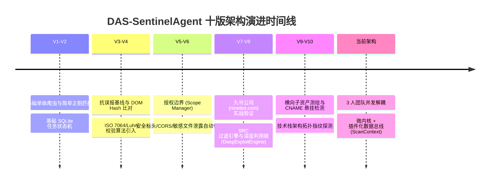
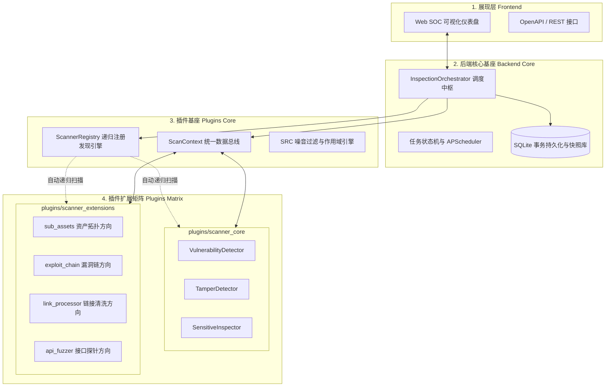

# 🏛️ 系统总体架构与演进历程

## 1. 项目诞生背景与使命

**DAS-SentinelAgent (安恒星巡)** 面向政企单位重保巡检、网站安全风险评估及安全响应中心 (SRC) 真实漏洞挖掘场景。系统不仅要求能够自动化完成**资产测绘、敏感信息检查、页面防篡改和常规漏洞扫描**，更强调**超低误报率**与**非破坏性深度验证闭环**。

---

## 2. 系统十版全面升级演进历史

在项目演进过程中，系统经历了由简入深、由单体向分布式的 10 版重大迭代升级：

### 迭代里程碑详述：
1. **V1~V2 (单体原型期)**：实现了基础广度优先异步爬虫 (`AssetCrawler`) 与关键词正则检索。
2. **V3~V4 (抗误报革命)**：
   - 引入 ISO 7064:1983.MOD 11-2 身份证校验码算法与 Luhn 银行卡校验算法，解决构建时间戳、静态资源版本号与误报干扰。
   - 页面防篡改模块引入 DOM 结构哈希对比，支持隐藏暗链 (`display:none`、负坐标 `left:-9999px`) 精准定位。
3. **V5~V6 (合规与安全边界控制)**：
   - 建立 `SRCScopeManager` 严格限制非授权外域请求，保证扫描行为合法合规。
   - 增加 Security Headers、CORS 任意 Origin 反射及 Git/Env 配置文件泄露探针。
4. **V7~V8 (实战化与深度利用链)**：
   - 针对授权站点（九号公司 `ninebot.com`）与本地靶场进行辅助验证，提炼出 `SRC-Filter`，自动过滤无实际危害的低价值噪音。
   - 打造 `DeepExploitEngine`，支持针对报错/布尔/时间盲注 SQLi、LFI 路径穿越、SSTI 模板注入与 BOLA 越权进行无害化推演。
5. **V9~V10 (资产测绘与攻击面拓扑)**：
   - 开发 `SubAssetExpander`：集成证书透明度 (`crt.sh`)、高价值子域字典、DNS 解析及 CNAME 悬挂 (Subdomain Takeover) 检测。
   - 开发 `ArchitectureFingerprintDetector`：自动分析前端、后端、中间件与 WAF 技术栈。
6. **最终形态 (微内核与插件解耦架构)**：
   - 彻底解决 3 人团队代码合并冲突难题，建立 `ScanContext` 数据总线与递归插件加载体系。

---

## 3. 当前系统分层架构总览

---

## 4. 为什么进行微内核插件化解耦？

随着团队规模发展为 **3 人并发协作**，在同一个巨型模块下修改代码极易产生 Git Merge Conflicts。通过将扫描逻辑从 `backend` 彻底剥离并转入 `plugins`，实现了：
- **物理隔离**：各人只在自己的目录下提交代码。
- **动态装载**：新增探测功能无需修改任何后端路由。
- **数据解耦**：所有通信收敛在 [[02-🧩_微内核与插件化总线规范]] 中定义的统一协议内。
