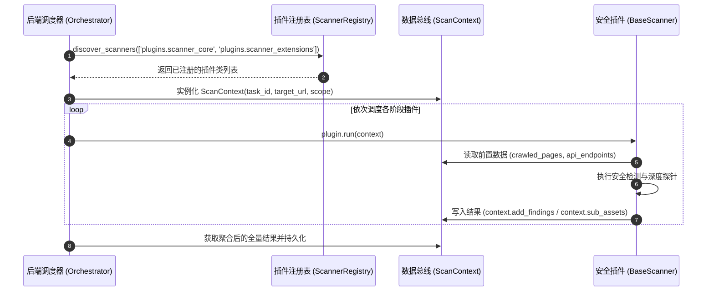

# 🧩 微内核与插件化总线规范

## 1. 核心设计原则

在 DAS-SentinelAgent 中，后端调度器 (`backend/app/agent/orchestrator.py`) 作为**微内核基座**，不直接依赖任何具体扫描器的代码实现。扫描器全部作为**可热插拔的独立插件**，通过统一数据总线与注册表实现生命周期管理。



---

## 2. 标准接口：`BaseScanner`

所有插件必须继承自 `plugins/core/base.py` 中定义的 `BaseScanner`，并实现异步 `run(context: ScanContext)` 方法：

```python
from abc import ABC, abstractmethod
from plugins.core.base import ScanContext

class BaseScanner(ABC):
    """所有安全扫描插件的标准抽象基类"""
    
    def __init__(self, *args, **kwargs):
        pass

    @abstractmethod
    async def run(self, context: ScanContext) -> None:
        """
        插件核心执行入口
        :param context: 包含任务所有上下文、前置测绘数据与风险汇总池的数据总线对象
        """
        raise NotImplementedError
```

---

## 3. 数据总线：`ScanContext`

`ScanContext` 承担各插件之间数据流转的“中枢总线”职责。任何插件只需关注从 `context` 消费需要的数据，并将生成的数据灌入 `context`：

### 核心属性一览表：

| 属性字段 | 类型 | 说明 | 写入者 (常见) | 消费者 (常见) |
| :--- | :--- | :--- | :--- | :--- |
| `task_id` | `str` | 巡检任务全局唯一 UUID | Orchestrator | 所有插件 |
| `target_url` | `str` | 待测主站根 URL | Orchestrator | 所有插件 |
| `auth_domains` | `List[str]` | 授权域名白名单列表 | Orchestrator | 作用域检查引擎 |
| `crawled_pages` | `List[Dict]` | 爬取到的页面 (URL/HTML/Headers) | `AssetCrawler` | `VulnDetector`, `TamperDetector` |
| `static_assets` | `Set[str]` | 发现的静态文件 (JS/CSS/图片) | `AssetCrawler` | `SensitiveInspector` |
| `api_endpoints` | `Set[str]` | 提取的 API 路由与接口端点 | `SmartLinkExtractor` | `RestApiProber`, `VulnDetector` |
| `external_links`| `List[str]` | 提取的全部外链 | `AssetCrawler` | `SubAssetExpander`, `TamperDetector` |
| `sub_assets` | `List[Dict]` | 发现的横向子域名与资产列表 | `SubAssetExpander` | `ArchitectureFingerprintDetector` |
| `findings` | `List[Dict]` | 风险漏洞结果集合池 | 各检测插件 | Orchestrator (去重与入库) |

### 写入风险结果的规范代码：

```python
context.add_findings([
    {
        "id": "vuln-uuid-001",
        "category": "VULN",
        "level": "HIGH",
        "title": "发现 SQL 注入漏洞 (Error-based SQLi)",
        "target": "http://example.com/api/user?id=1",
        "evidence": "MySQL syntax error in response",
        "remediation": "使用预编译参数化查询 (Prepared Statements)"
    }
])
```

---

## 4. 递归自动发现：`ScannerRegistry`

`plugins/core/registry.py` 通过 `pkgutil.walk_packages` 实现了多层级子目录的递归自动发现机制：

```python
# 递归遍历目录，无需手动 import 每一个子包
scanner_registry.discover_scanners([
    'plugins.scanner_core',
    'plugins.scanner_extensions'
])
```

> [!TIP]
> **团队开发零侵入体验**：
> 安全工程师在 `plugins/scanner_extensions/` 下新建任意子目录与 `.py` 文件，只要继承了 `BaseScanner`，系统在启动时就会**完全自动发现并装载**，无需通知后端同事改动任何配置！

---

## 5. 导航与关联
- 了解核心扫描插件：[[03-🎯_核心扫描区详解(scanner_core)]]
- 了解扩展扫描插件：[[04-🌐_扩展扫描区详解(scanner_extensions)]]
