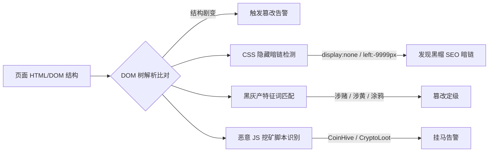

# 🎯 核心扫描区详解 (`plugins/scanner_core`)

## 1. 区域定位与职责

`plugins/scanner_core/` 是系统最底层的**原生安全检测矩阵**。本目录只存放**直接产出高置信度风险判定**的核心检测算法，保持高度纯粹与精简。

```text
plugins/scanner_core/
├── vuln_detector.py        # 1. 常见高危漏洞与弱配置检测探针
├── tamper_detector.py      # 2. 页面防篡改、挂马脚本与暗链检测引擎
└── sensitive_inspector.py  # 3. 多模态敏感数据与凭证泄露检查器
```

---

## 2. 核心模块一：`vuln_detector.py` (漏洞检测探针)

涵盖 Web 常见配置缺陷、信息泄露与高危参数型漏洞探针：

### 检测能力矩阵：
1. **配置与信息泄露**：
   - 敏感文件暴露：`.git/config`, `.env`, `docker-compose.yml`, `phpinfo.php`, `web.config` 等。
   - 安全响应头缺失与弱配置：CSP, HSTS, X-Frame-Options, X-Content-Type-Options。
   - CORS 跨域缺陷：检查任意 `Origin: evil.com` 反射与 `Access-Control-Allow-Credentials: true`。
   - Cookie 标志位：检测 `HttpOnly` 与 `Secure` 属性缺失。
2. **高危漏洞探针 (启发式与上下文感知)**：
   - **XSS 跨站脚本**：区分 HTML 属性、Body 标签、JS 字符串等上下文环境注入感知探针。
   - **SQL 注入**：报错注入 (Error-based)、布尔差分 (Boolean-based)、时间盲注 (Time-based)。
   - **LFI / 路径穿越**：Linux `/etc/passwd`、Windows `win.ini` 穿越特征。
   - **SSTI 模板注入**：Jinja2/Twig 运算表达式验证 (`{{972*407}} -> 395604`)。
   - **命令注入**：基于分隔符 (`|`, `;`, `&&`) 的无害化命令回显验证。
   - **SSRF 服务端请求伪造**：云厂商元数据 (`169.254.169.254`) 探针。
   - **API 未授权与 BOLA**：未授权敏感字段暴露与 ID 水平越权遍历。

---

## 3. 核心模块二：`tamper_detector.py` (页面防篡改与反挂马)

针对政企主站被黑产篡改、植入暗链的重保监控利器：



---

## 4. 核心模块三：`sensitive_inspector.py` (敏感数据检查)

采用**“正则提取 + 严格校验码数学算法 + 上下文消歧”**三重过滤，实现近乎 0 误报：

1. **身份证号 (18 位)**：
   - 校验 ISO 7064:1983.MOD 11-2 加权校验码计算；
   - 校验前 6 位行政区划代码合法性与出生年份范围 (1900~当前年份)。
2. **银行卡号 (16~19 位)**：
   - 严格执行 **Luhn 算法 (模 10 校验)**；
   - 自动排除连续递增递减数字与全同数字。
3. **中国大陆手机号 (11 位)**：
   - 匹配国内三大运营商最新合法号段前缀；
   - 排除前后相连的数字干扰（避免将静态资源版本号误判为手机号）。
4. **云服务凭据与敏感 Key**：
   - 阿里云 AK/SK (`LTAI...`)、腾讯云 SecretId/Key、AWS AccessKey、JWT 凭证。
5. **企业自定义敏感词库**：
   - 支持在任务范围 `custom_sensitive_keywords` 中下发单位特定涉密/内部关键词。

---

## 5. 辅助过滤基准：`src_filter.py` (SRC 降噪引擎)

为了使扫描结果符合企业 SRC (Security Response Center) 的真实漏洞认定标准，系统在收敛阶段自动执行 SRC 边界过滤：
- 自动剔除 HTTP 安全标头缺失、版本泄露等纯 INFO 噪音；
- 保留真正具有可利用性或高合规风险的条目。

---

## 6. 导航与关联
- 了解扩展扫描区：[[04-🌐_扩展扫描区详解(scanner_extensions)]]
- 了解团队协作指南：[[05-👥_团队三人并发协同与开发手册]]
