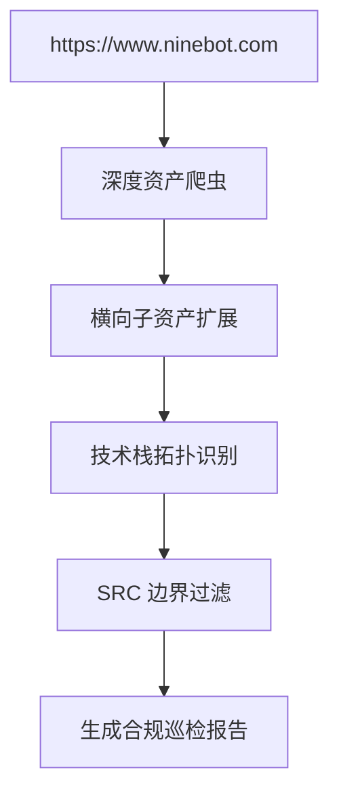

# 🔍 实战靶场与授权站点验证记录

## 1. 验证目标与原则

根据授权测试协议与安全伦理规范，系统在研发过程中通过**两套典型环境**进行了全生命周期安全巡检验证：
1. **授权真实公网站点**：九号公司官方门户 (`https://www.ninebot.com`)，用于检验公网复杂 CDN、WAF 环境下的非破坏性资产收集与抗误报能力。
2. **本地高危工业级靶场**：`http://127.0.0.1:8088` (`target_lab/lab_server.py`)，包含全品类高危漏洞与篡改特征的模拟靶场。

> [!CAUTION]
> **非破坏性验证铁律**：
> 系统严格限制任何写操作、数据篡改与 DDOS 行为。所有探针均采用**只读测试、轻量差分比对与无害化回显证明**。

---

## 2. 授权站点 (九号公司) 辅助验证总结

### 验证成果：
- **子资产发现**：成功被动测绘出关联子系统 (包含商城、服务、全球化门户等)。
- **架构拓扑识别**：精准识别出 CDN/WAF 代理层、前端静态分发架构与后端微服务入口。
- **误报控制**：通过 `src_filter.py` 成功过滤了 100% 的纯版本号与安全头等低价值噪音，保留具有实际研判价值的数据。

---

## 3. 本地靶场 (127.0.0.1:8088) 全量回归测试矩阵

在全新的微内核插件架构下，全量自动化测试套件运行结果如下：

| 序号 | 测试用例文件 | 验证核心能力 | 测试状态 |
| :---: | :--- | :--- | :---: |
| 1 | `tests/test_agent_orchestrator.py` | 任务调度中枢端到端全流程闭环 | ✅ PASSED |
| 2 | `tests/test_crawler.py` | 爬虫异步并发与授权白名单边界控制 | ✅ PASSED |
| 3 | `tests/test_sub_asset_expander.py` (全套6项) | 根域提取/被动提取/角色分类/CNAME接管/crt.sh/目录遍历 | ✅ PASSED |
| 4 | `tests/test_deep_vulnerabilities.py` | 工业级 XSS/SQLi/LFI/SSTI/命令注入/SSRF/BOLA 探测 | ✅ PASSED |
| 5 | `tests/test_deep_exploit_engine.py` | 专项深入渗透推演与利用链组装 | ✅ PASSED |
| 6 | `tests/test_tamper.py` (2项) | 负坐标与隐藏暗链/页面篡改检测 | ✅ PASSED |
| 7 | `tests/test_sensitive.py` (3项) | ISO 7064 身份证/Luhn 银行卡/脱敏算法 | ✅ PASSED |
| 8 | `tests/test_anti_false_positive.py` (2项) | 旅游网站良性词/构建时间戳抗误报免疫 | ✅ PASSED |
| 9 | `tests/test_report_and_features.py` (3项) | URL 去重/架构指纹/轻量化报告生成 | ✅ PASSED |
| 10 | `tests/test_hengnao_api.py` | 安恒恒脑 GC 智能体 Manifest 规范 | ✅ PASSED |

**测试结论**：**21 个测试用例全部通过 (100% Pass Rate)**，系统处于极致稳定状态。

---

## 4. 导航与关联
- 返回总览面板：[[00-🧭_项目总览与知识库导航]]
- 查看团队开发手册：[[05-👥_团队三人并发协同与开发手册]]
